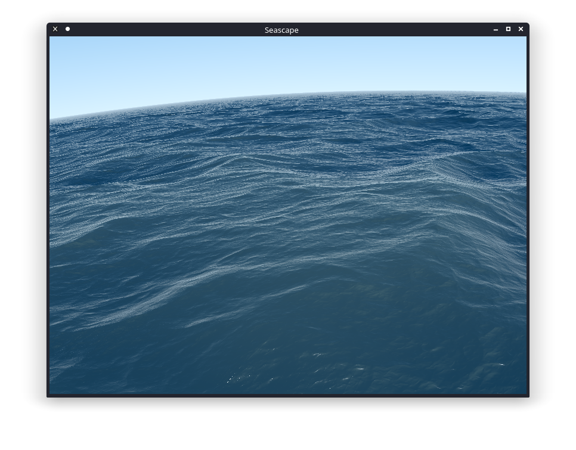

# seascape-glsl

Based on [Shadertoy Seascape](https://www.shadertoy.com/view/Ms2SD1)

## Install deps
```sh
sudo apt install cmake libgsl-dev libglfw3-dev libglew-dev
```

## Preview

https://get-color.ru/#DCDCDC

https://get-color.ru/#007CAD

https://get-color.ru/#7BA05B

